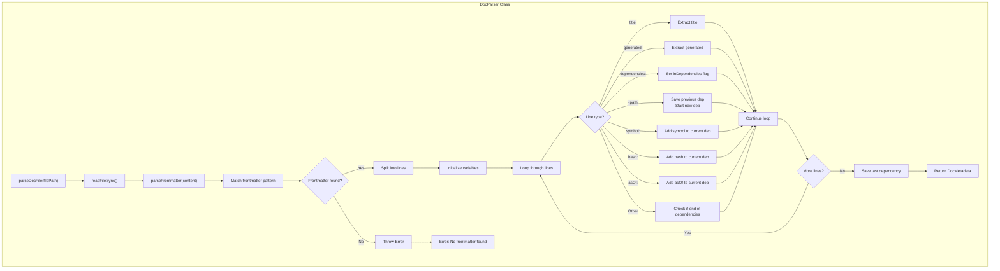

# DocParser

The `DocParser` class provides functionality for parsing documentation files and extracting metadata from YAML frontmatter. It specifically handles markdown files with structured frontmatter containing title, generation timestamp, and dependency information.

<details>
<summary>Visual Flow</summary>



</details>

<details>
<summary>Methods</summary>

### `parseDocFile(filePath: string): DocMetadata`

Parses a documentation file from the filesystem and extracts metadata from its YAML frontmatter. This is the main entry point for the class.

**Parameters:**
- `filePath`: `string` - Path to the documentation file to parse

**Returns:** `DocMetadata` object containing parsed metadata

### `parseFrontmatter(content: string): DocMetadata` (private)

Parses YAML frontmatter from markdown content string. Handles the actual parsing logic for extracting `title`, `generated`, and `dependencies` fields.

**Parameters:**
- `content`: `string` - Raw markdown content with frontmatter

**Returns:** `DocMetadata` object with extracted frontmatter data

</details>

<details>
<summary>Return Value</summary>

Both methods return a `DocMetadata` object with the following structure:

```typescript
{
  title: string;           // Document title
  generated: string;       // Generation timestamp (ISO string)
  dependencies: DocDependency[]; // Array of dependency objects
}
```

Each `DocDependency` contains:
```typescript
{
  path: string;    // File path of the dependency
  symbol: string;  // Symbol name within the file
  hash: string;    // Content hash of the symbol
  asOf?: string;   // Optional commit reference
}
```

</details>

<details>
<summary>Usage Examples</summary>

### Basic File Parsing

```typescript
const parser = new DocParser();

// Parse a documentation file
const metadata = parser.parseDocFile('./docs/api.md');

console.log(metadata.title);      // "API Documentation" 
console.log(metadata.generated);  // "2026-02-03T00:00:00Z"
console.log(metadata.dependencies.length); // 2
```

### Handling Dependencies

```typescript
const parser = new DocParser();
const metadata = parser.parseDocFile('./docs/functions.md');

// Iterate through dependencies
metadata.dependencies.forEach(dep => {
  console.log(`${dep.symbol} from ${dep.path}`);
  console.log(`Hash: ${dep.hash}`);
  if (dep.asOf) {
    console.log(`As of commit: ${dep.asOf}`);
  }
});
```

### Error Handling

```typescript
const parser = new DocParser();

try {
  const metadata = parser.parseDocFile('./invalid-doc.md');
} catch (error) {
  console.error('Failed to parse:', error.message);
  // "No frontmatter found in doc file"
}
```

</details>

<details>
<summary>Implementation Details</summary>

The parser uses a custom YAML parsing implementation rather than a full YAML library. It works by:

1. **Pattern Matching**: Uses regex `/^---\n([\s\S]*?)\n---/` to extract frontmatter content
2. **Line-by-Line Parsing**: Processes each line individually, tracking state with flags like `inDependencies`
3. **State Management**: Maintains `currentDep` object while building dependency entries
4. **Field Extraction**: Uses `substring()` operations to extract values after field names

**Dependency Parsing Logic:**
- Detects `- path:` to start a new dependency entry
- Saves the previous dependency when starting a new one
- Requires `path`, `symbol`, and `hash` fields to be considered complete
- `asOf` field is optional and added if present
- Exits dependency parsing when encountering non-dependency content

</details>

<details>
<summary>Edge Cases</summary>

### Missing Frontmatter
Files without `---` delimited frontmatter will throw an error immediately.

### Incomplete Dependencies
Dependencies missing required fields (`path`, `symbol`, or `hash`) are silently dropped and not included in the results.

### Malformed YAML
The parser is tolerant of spacing issues but expects exact field names (`title:`, `generated:`, etc.). Typos in field names will cause those fields to be ignored.

### Empty Dependencies Array
If `dependencies:` is present but no valid dependencies follow, an empty array is returned.

### Special Characters
Field values are taken as-is after the colon, so special characters and spaces are preserved. No additional YAML escaping is handled.

### Multiple Dependencies Sections
Only the first `dependencies:` section is processed. Subsequent ones are ignored.

</details>

<details>
<summary>Related</summary>

This class is typically used alongside:
- `DocMetadata` interface - defines the return type structure
- `DocDependency` interface - defines individual dependency structure  
- File system operations - requires `readFileSync` from Node.js `fs` module
- Documentation generation pipelines - often used to validate or update existing docs
- Content hashing utilities - works with hash values from symbol content hashing

</details>