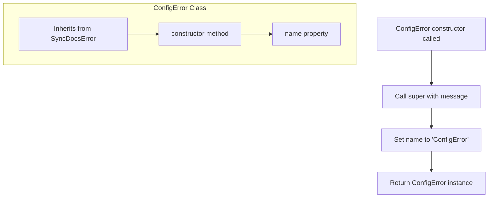

# ConfigError

`ConfigError` is a specialized error class that extends `SyncDocsError` to represent configuration-related errors. It provides a standardized way to handle and identify errors that occur due to configuration issues within the application.

<details>
<summary>Visual Flow</summary>



</details>

<details>
<summary>Parameters</summary>

The `ConfigError` constructor accepts the following parameter:

- `message` (`string`): A descriptive error message explaining the configuration issue that occurred

</details>

<details>
<summary>Methods</summary>

- `constructor(message: string)`: Creates a new `ConfigError` instance with the specified error message. Sets the error name to `'ConfigError'` and calls the parent `SyncDocsError` constructor.

</details>

<details>
<summary>Usage Examples</summary>

```typescript
// Basic usage - throwing a configuration error
throw new ConfigError('Invalid API endpoint configuration');

// Catching and handling ConfigError
try {
  // Some configuration operation
  loadConfiguration();
} catch (error) {
  if (error instanceof ConfigError) {
    console.error('Configuration error:', error.message);
    // Handle configuration-specific error
  }
}

// Using in validation functions
function validateConfig(config: any): void {
  if (!config.apiKey) {
    throw new ConfigError('API key is required in configuration');
  }
  
  if (!config.baseUrl) {
    throw new ConfigError('Base URL must be specified in configuration');
  }
}

// Error handling with specific ConfigError identification
try {
  validateConfig(userConfig);
} catch (error) {
  if (error.name === 'ConfigError') {
    // Specifically handle configuration errors
    displayConfigurationHelp();
  }
  throw error;
}
```

</details>

<details>
<summary>Implementation Details</summary>

- Extends `SyncDocsError` to inherit base error functionality
- Explicitly sets the `name` property to `'ConfigError'` to enable specific error type identification
- Follows standard JavaScript error class patterns by calling `super()` with the message parameter
- The error message is passed through to the parent class unchanged
- Maintains the error stack trace through proper inheritance

</details>

<details>
<summary>Edge Cases</summary>

- **Empty message**: While an empty string is technically valid, it's recommended to provide meaningful error messages for better debugging
- **Null/undefined message**: TypeScript will prevent this at compile time, but at runtime would be passed to the parent constructor
- **Error identification**: Use `instanceof ConfigError` or check `error.name === 'ConfigError'` for reliable error type detection
- **Stack traces**: The error will maintain the stack trace from where it was thrown, not from the constructor

</details>

<details>
<summary>Related</summary>

- `SyncDocsError`: Parent class that `ConfigError` extends
- Standard JavaScript `Error` class: Ultimate parent in the inheritance chain
- Other potential error classes in the same application that may extend `SyncDocsError`
- Configuration validation functions that might throw `ConfigError` instances

</details>