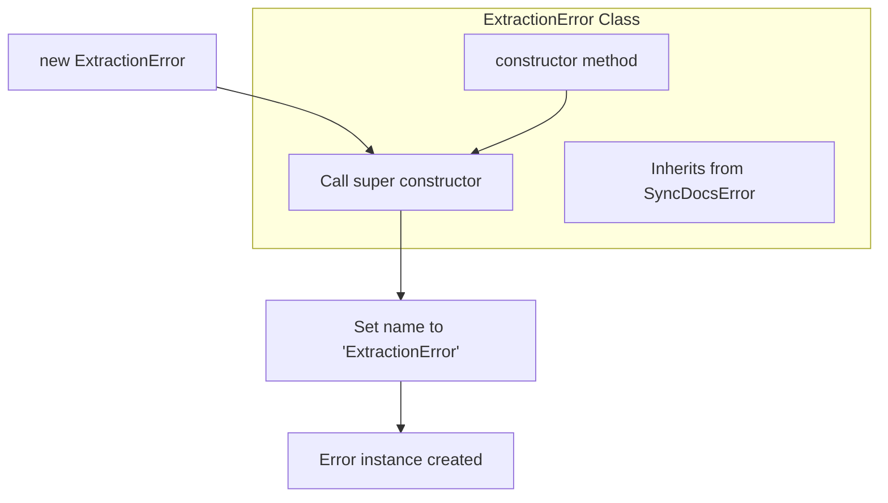

# ExtractionError

A specialized error class that extends `SyncDocsError` for handling extraction-related failures. This class provides a standardized way to represent errors that occur during data or content extraction operations, with a consistent error name identifier.

<details>
<summary>Visual Flow</summary>



</details>

<details>
<summary>Parameters</summary>

### Constructor Parameters

- `message` (`string`) - The error message describing the extraction failure. This message will be accessible via the standard `Error.message` property.

</details>

<details>
<summary>Methods</summary>

### `constructor(message: string)`

Creates a new `ExtractionError` instance with the specified error message. The constructor automatically sets the error name to `'ExtractionError'` for consistent error identification.

**Inherited Methods:**
- All methods inherited from `SyncDocsError` and the base `Error` class
- Standard error properties: `message`, `name`, `stack`

</details>

<details>
<summary>Usage Examples</summary>

```typescript
// Basic usage - throwing an extraction error
throw new ExtractionError('Failed to extract metadata from document');

// Catching and handling extraction errors
try {
  // Some extraction operation
  await extractDocumentContent(filePath);
} catch (error) {
  if (error instanceof ExtractionError) {
    console.error('Extraction failed:', error.message);
    // Handle extraction-specific error
  } else {
    // Handle other error types
    throw error;
  }
}

// Creating and storing for later use
const extractionError = new ExtractionError('Unable to parse file format');
console.log(extractionError.name); // 'ExtractionError'
console.log(extractionError.message); // 'Unable to parse file format'

// Using in async operations
async function processFiles(files: string[]): Promise<void> {
  for (const file of files) {
    try {
      await extractContent(file);
    } catch (error) {
      throw new ExtractionError(`Failed to process file ${file}: ${error.message}`);
    }
  }
}
```

</details>

<details>
<summary>Implementation Details</summary>

The `ExtractionError` class follows the standard JavaScript error subclassing pattern:

1. **Inheritance Chain**: `ExtractionError` → `SyncDocsError` → `Error`
2. **Constructor Behavior**: 
   - Calls the parent `SyncDocsError` constructor with the provided message
   - Explicitly sets the `name` property to `'ExtractionError'` for consistent error identification
3. **Error Properties**:
   - `message`: The descriptive error message passed to the constructor
   - `name`: Always set to `'ExtractionError'`
   - `stack`: Stack trace (inherited from base `Error` class)

The class maintains proper prototype chain relationships, allowing for accurate `instanceof` checks and proper error handling patterns.

</details>

<details>
<summary>Edge Cases</summary>

- **Empty Message**: If an empty string is passed as the message, the error will still be created but with no descriptive text
- **Null/Undefined Message**: TypeScript typing prevents this, but at runtime would be converted to string representation
- **Error Serialization**: When serialized to JSON, only enumerable properties are included (typically excludes `stack` trace)
- **Cross-Boundary Usage**: When crossing module or execution context boundaries, `instanceof` checks may fail; use `error.name === 'ExtractionError'` for reliable type checking

</details>

<details>
<summary>Related</summary>

- `SyncDocsError` - Parent error class that this extends
- `Error` - Base JavaScript error class
- Other potential error classes in the same system that may extend `SyncDocsError`
- Error handling patterns and best practices for TypeScript applications

</details>