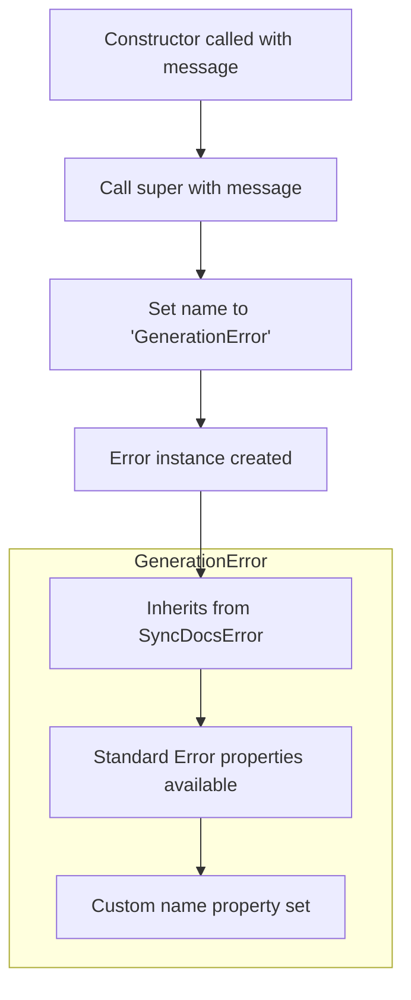

# GenerationError

The `GenerationError` class is a custom error type that extends `SyncDocsError` and is used to represent errors that occur during document generation processes. It provides a specialized error type with a distinct name identifier for better error handling and debugging in synchronization and documentation workflows.

<details>
<summary>Visual Flow</summary>



</details>

<details>
<summary>Parameters</summary>

**Constructor Parameters:**

- `message` (`string`) - The error message that describes the generation error that occurred

</details>

<details>
<summary>Methods</summary>

**Constructor:**
- `constructor(message: string)` - Creates a new `GenerationError` instance with the specified message

**Inherited Methods:**
- Inherits all methods from `SyncDocsError` and the standard JavaScript `Error` class
- `toString()` - Returns string representation of the error
- `stack` - Provides stack trace information

</details>

<details>
<summary>Usage Examples</summary>

**Basic Error Creation:**
```typescript
throw new GenerationError('Failed to generate documentation for module');
```

**Error Handling in Generation Process:**
```typescript
try {
  generateDocumentation(config);
} catch (error) {
  if (error instanceof GenerationError) {
    console.error('Generation failed:', error.message);
    // Handle generation-specific error
  }
}
```

**Using in Async Functions:**
```typescript
async function processDocuments(): Promise<void> {
  try {
    await generateAllDocs();
  } catch (error) {
    throw new GenerationError(`Document processing failed: ${error.message}`);
  }
}
```

**Type-Safe Error Checking:**
```typescript
function handleError(error: unknown): void {
  if (error instanceof GenerationError) {
    // TypeScript knows this is a GenerationError
    logGenerationError(error.message);
  } else {
    logGenericError(error);
  }
}
```

</details>

<details>
<summary>Implementation Details</summary>

The `GenerationError` class follows the standard JavaScript error extension pattern:

1. **Inheritance Chain:** `GenerationError` → `SyncDocsError` → `Error`
2. **Name Property:** Sets `this.name = 'GenerationError'` to override the default error name
3. **Message Delegation:** Passes the message parameter directly to the parent constructor via `super(message)`
4. **No Additional Properties:** Keeps the implementation minimal, relying on inherited error functionality

The class maintains the standard error contract while providing semantic meaning for generation-related failures in the documentation system.

</details>

<details>
<summary>Edge Cases</summary>

**Empty Message:**
```typescript
// Still valid, creates error with empty message
const error = new GenerationError('');
console.log(error.message); // ''
```

**Undefined/Null Message:**
```typescript
// TypeScript prevents this, but at runtime:
const error = new GenerationError(undefined as any);
console.log(error.message); // 'undefined'
```

**Stack Trace Preservation:**
- The error maintains proper stack trace information through the inheritance chain
- Stack traces will show the `GenerationError` name in error outputs

**Serialization:**
```typescript
const error = new GenerationError('Test error');
console.log(JSON.stringify(error)); // May not include all properties
console.log(error.toString()); // 'GenerationError: Test error'
```

</details>

<details>
<summary>Related</summary>

- `SyncDocsError` - Parent class that this extends
- `Error` - Base JavaScript error class
- Other potential sibling error classes in the sync docs system
- Error handling utilities and logging systems that may consume this error type

</details>