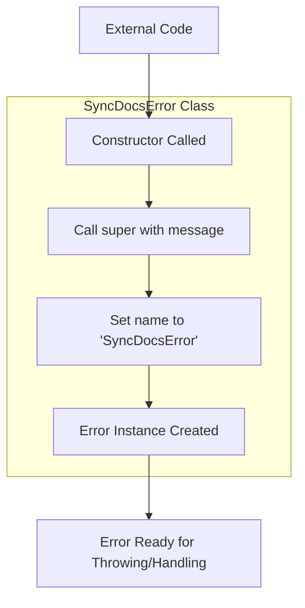

# SyncDocsError

A custom error class that extends the native JavaScript `Error` class, specifically designed for handling synchronization-related errors in documentation operations. This class provides a standardized way to identify and handle errors that occur during document synchronization processes.

<details>
<summary>Visual Flow</summary>



</details>

<details>
<summary>Parameters</summary>

The constructor accepts the following parameter:

- `message` (`string`) - The error message that describes the specific synchronization issue that occurred. This message will be displayed when the error is thrown or logged.

</details>

<details>
<summary>Methods</summary>

This class inherits all methods from the native `Error` class:

- `constructor(message: string)` - Creates a new `SyncDocsError` instance with the specified message
- `toString()` - Returns a string representation of the error (inherited)
- `valueOf()` - Returns the primitive value of the error object (inherited)

Additional properties available:
- `name` (`string`) - Always set to `'SyncDocsError'` to identify the error type
- `message` (`string`) - The error message passed to the constructor
- `stack` (`string`) - Stack trace information (inherited, browser-dependent)

</details>

<details>
<summary>Usage Examples</summary>

```typescript
// Basic usage - throwing a sync error
throw new SyncDocsError('Failed to synchronize document with remote server');

// Using in async operations
async function syncDocument(docId: string): Promise<void> {
  try {
    await performSync(docId);
  } catch (error) {
    throw new SyncDocsError(`Document sync failed for ${docId}: ${error.message}`);
  }
}

// Error handling with type checking
try {
  await syncAllDocuments();
} catch (error) {
  if (error instanceof SyncDocsError) {
    console.error('Sync operation failed:', error.message);
    // Handle sync-specific error
  } else {
    console.error('Unexpected error:', error);
    // Handle other types of errors
  }
}

// Using in validation scenarios
function validateSyncStatus(status: string): void {
  if (!['pending', 'completed', 'failed'].includes(status)) {
    throw new SyncDocsError(`Invalid sync status: ${status}`);
  }
}
```

</details>

<details>
<summary>Implementation Details</summary>

The `SyncDocsError` class follows the standard pattern for creating custom error classes in TypeScript/JavaScript:

1. **Inheritance**: Extends the native `Error` class to maintain compatibility with existing error handling mechanisms
2. **Constructor**: Calls `super(message)` to properly initialize the parent `Error` class with the provided message
3. **Name Property**: Explicitly sets the `name` property to `'SyncDocsError'` for easy identification and debugging
4. **Type Safety**: Being a class, it can be used with `instanceof` checks for type-safe error handling

The class maintains all standard error functionality while providing a specific error type for documentation synchronization contexts.

</details>

<details>
<summary>Edge Cases</summary>

- **Empty Message**: If an empty string is passed as `message`, the error will still be created but may not provide useful debugging information
- **Non-string Message**: TypeScript will prevent non-string values, but at runtime, passing other types will be converted to strings via the `Error` constructor
- **Stack Trace**: The stack trace will point to where the `SyncDocsError` was instantiated, not necessarily where the underlying sync issue occurred
- **Serialization**: When serialized to JSON, only enumerable properties (`message`, `name`) will be included; the `stack` trace may not serialize properly across all environments

</details>

<details>
<summary>Related</summary>

- Native JavaScript `Error` class - The parent class that `SyncDocsError` extends
- `instanceof` operator - Used for type checking `SyncDocsError` instances
- Error handling patterns - Try-catch blocks, async error handling, promise rejections
- Custom error hierarchies - Creating additional specialized error types that extend `SyncDocsError`
- Logging frameworks - Often used in conjunction with custom error types for better error categorization

</details>