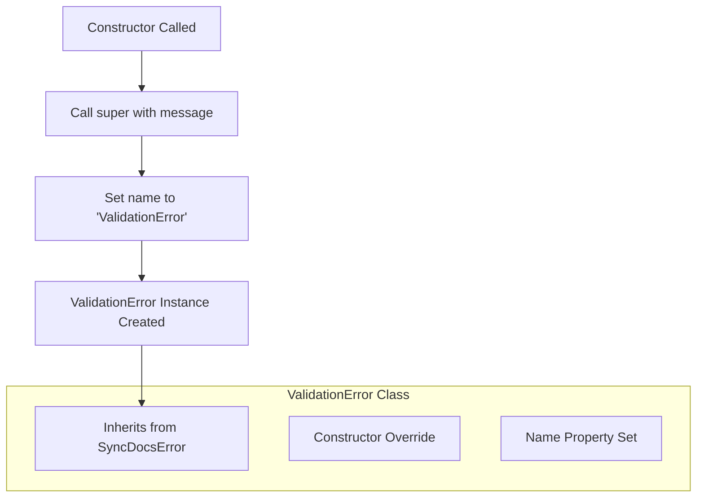

# ValidationError

A specialized error class that extends `SyncDocsError` for representing validation-related failures. This class provides a distinct error type with a standardized name identifier for validation errors within the SyncDocs system.

<details>
<summary>Visual Flow</summary>



</details>

<details>
<summary>Parameters</summary>

### Constructor Parameters

- `message`: `string` - The error message describing the validation failure

</details>

<details>
<summary>Methods</summary>

### Constructor

```typescript
constructor(message: string)
```

Creates a new `ValidationError` instance with the specified message. Sets the error name to `'ValidationError'` for proper identification in error handling and logging.

</details>

<details>
<summary>Usage Examples</summary>

### Basic Usage

```typescript
// Throwing a validation error
if (!isValidEmail(email)) {
  throw new ValidationError('Invalid email format provided');
}
```

### Error Handling

```typescript
try {
  validateUserInput(data);
} catch (error) {
  if (error instanceof ValidationError) {
    console.log('Validation failed:', error.message);
    // Handle validation-specific logic
  } else {
    console.log('Unexpected error:', error);
  }
}
```

### Custom Validation Function

```typescript
function validateConfiguration(config: Config): void {
  if (!config.apiKey) {
    throw new ValidationError('API key is required in configuration');
  }
  
  if (config.timeout < 0) {
    throw new ValidationError('Timeout value must be non-negative');
  }
}
```

</details>

<details>
<summary>Implementation Details</summary>

The `ValidationError` class follows the standard JavaScript error extension pattern:

1. **Inheritance**: Extends `SyncDocsError` to maintain the error hierarchy within the SyncDocs system
2. **Super Call**: Passes the error message to the parent constructor to ensure proper error message handling
3. **Name Override**: Sets the `name` property to `'ValidationError'` to distinguish it from other error types

This implementation ensures that:
- Stack traces are properly maintained through the parent class
- Error instances can be identified using `instanceof ValidationError`
- The error name appears correctly in logs and debugging output

</details>

<details>
<summary>Edge Cases</summary>

### Empty Message

```typescript
// Valid but not recommended
const error = new ValidationError('');
console.log(error.message); // Empty string
```

### Type Checking

```typescript
// Always use instanceof for type checking
if (error instanceof ValidationError) {
  // Correct approach
}

// Avoid name-based checking as it can be unreliable
if (error.name === 'ValidationError') {
  // Less reliable approach
}
```

### Error Serialization

When serializing errors (e.g., for API responses), the `name` property will be preserved, but custom handling may be needed for the full error context.

</details>

<details>
<summary>Related</summary>

- `SyncDocsError` - Parent error class
- Error handling patterns in the SyncDocs system
- Validation utilities and functions that may throw this error type
- JavaScript Error class documentation
- TypeScript error handling best practices

</details>