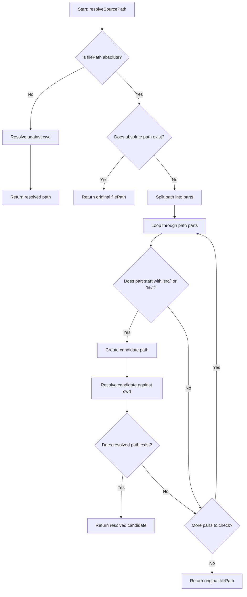

# resolveSourcePath

Resolves a file path to an absolute path by checking multiple resolution strategies. The function handles relative paths, absolute paths, and attempts intelligent source path resolution by looking for common source directory patterns like `src/` and `lib/`.

<details>
<summary>Visual Flow</summary>



</details>

<details>
<summary>Parameters</summary>

- `filePath: string` - The file path to resolve. Can be relative or absolute.
- `cwd: string` - The current working directory to resolve relative paths against. Defaults to `process.cwd()`.

</details>

<details>
<summary>Return Value</summary>

Returns a `string` representing the resolved absolute file path. The function guarantees to return a path, falling back to the original `filePath` if no valid resolution is found.

</details>

<details>
<summary>Usage Examples</summary>

```typescript
import { resolveSourcePath } from './path-utils';

// Resolve relative path
const relativePath = resolveSourcePath('src/components/Button.tsx');
// Returns: '/current/working/directory/src/components/Button.tsx'

// Absolute path that exists
const absolutePath = resolveSourcePath('/home/user/project/src/index.ts');
// Returns: '/home/user/project/src/index.ts' (if it exists)

// Intelligent source resolution for broken absolute paths
const brokenPath = resolveSourcePath('/some/old/path/src/utils/helper.ts', '/project/root');
// Attempts to resolve 'src/utils/helper.ts' against '/project/root'
// Returns: '/project/root/src/utils/helper.ts' (if it exists)

// Custom working directory
const customCwd = resolveSourcePath('lib/index.js', '/custom/project/root');
// Returns: '/custom/project/root/lib/index.js'

// Fallback behavior
const nonExistent = resolveSourcePath('/completely/invalid/path.ts');
// Returns: '/completely/invalid/path.ts' (original path as fallback)
```

</details>

<details>
<summary>Implementation Details</summary>

The function uses a three-tier resolution strategy:

1. **Relative Path Resolution**: If the input path is not absolute (checked via `isAbsolute()`), it's resolved against the provided `cwd` using Node.js `resolve()`.

2. **Existing Absolute Path**: If the path is absolute and exists on the filesystem (verified with `existsSync()`), it's returned as-is.

3. **Intelligent Source Resolution**: For absolute paths that don't exist, the function splits the path and iterates through segments looking for common source directory patterns (`src/` or `lib/`). When found, it attempts to resolve these partial paths against the `cwd`.

The function relies on Node.js built-in modules:
- `path.isAbsolute()` for path type detection
- `path.resolve()` for path resolution
- `fs.existsSync()` for filesystem checks

</details>

<details>
<summary>Edge Cases</summary>

- **Empty or invalid paths**: The function doesn't validate input and will pass through invalid paths to Node.js path functions, which may throw errors.

- **Permission issues**: `existsSync()` may return `false` for paths that exist but aren't readable due to permission restrictions.

- **Symlinks**: The function follows symlinks when checking existence, which may lead to unexpected behavior if symlinks point to non-existent targets.

- **Multiple source directories**: If a path contains multiple `src/` or `lib/` segments, the function will try each possibility in order, potentially returning an unexpected match.

- **Case sensitivity**: Path matching is case-sensitive on Unix-like systems but case-insensitive on Windows, which may cause inconsistent behavior across platforms.

- **Network paths**: The function doesn't handle UNC paths or network locations specially and may have unpredictable behavior with such inputs.

</details>

<details>
<summary>Related</summary>

- Node.js `path.resolve()` - Used internally for path resolution
- Node.js `path.isAbsolute()` - Used for path type detection  
- Node.js `fs.existsSync()` - Used for filesystem existence checks
- `process.cwd()` - Default value for the `cwd` parameter

</details>