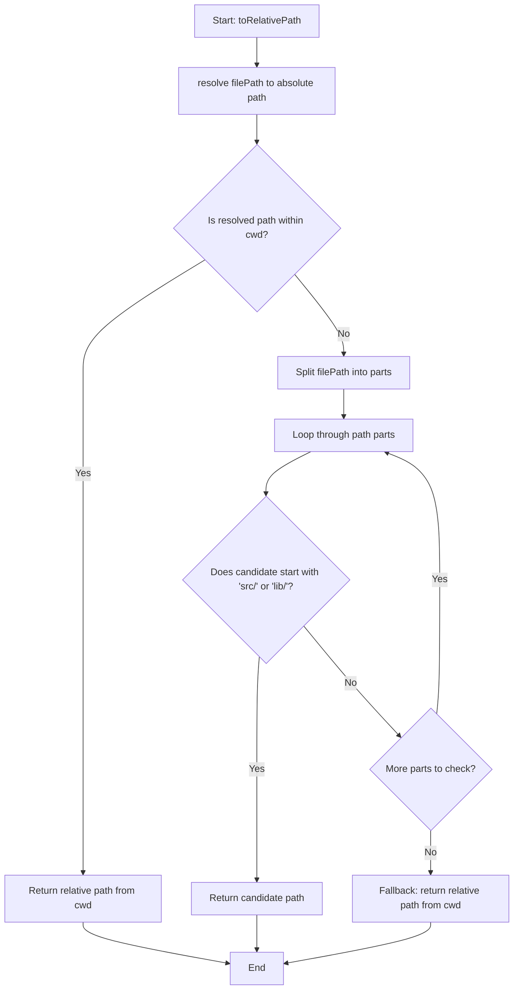

# toRelativePath

Converts a file path to a relative path, with special handling for different worktree scenarios. The function intelligently determines the most appropriate relative representation by checking if the path is within the current working directory or by extracting common source directory patterns.

<details>
<summary>Visual Flow</summary>



</details>

<details>
<summary>Parameters</summary>

- `filePath`: `string` - The file path to convert to a relative path. Can be absolute or relative.
- `cwd`: `string` - The current working directory to use as the base for relative path calculation. Defaults to `process.cwd()`.

</details>

<details>
<summary>Return Value</summary>

Returns a `string` representing the relative path. The returned path will be:
- A standard relative path if the file is within the `cwd`
- A path starting with common source directories (`src/` or `lib/`) if found in the path structure
- A fallback relative path (which may include `../` segments) if no other pattern matches

</details>

<details>
<summary>Usage Examples</summary>

```typescript
// File within current working directory
toRelativePath('/home/user/project/src/utils.ts', '/home/user/project');
// Returns: 'src/utils.ts'

// File with src/ pattern from different worktree
toRelativePath('/other/worktree/project/src/components/Button.tsx');
// Returns: 'src/components/Button.tsx'

// File with lib/ pattern
toRelativePath('/different/path/mylib/lib/index.js');
// Returns: 'lib/index.js'

// File outside cwd without common patterns
toRelativePath('/completely/different/path/file.js', '/home/user/project');
// Returns: '../../completely/different/path/file.js'

// Using default cwd
toRelativePath('./src/index.ts');
// Returns relative path based on process.cwd()
```

</details>

<details>
<summary>Implementation Details</summary>

The function uses a three-tier approach to determine the best relative path:

1. **Primary**: Uses Node.js `resolve()` to get the absolute path, then checks if it's within the specified `cwd` using string prefix matching. If so, uses `relative()` for a clean relative path.

2. **Secondary**: For paths outside the `cwd` (common in monorepos or multi-worktree scenarios), splits the original `filePath` and searches for common source directory patterns (`src/` or `lib/`). Returns the first matching pattern found.

3. **Fallback**: Uses Node.js `relative()` function which may produce paths with `../` segments to traverse up the directory structure.

The function preserves the intent of the original path structure while providing meaningful relative paths for cross-worktree scenarios.

</details>

<details>
<summary>Edge Cases</summary>

- **Exact `cwd` match**: If the resolved path equals the `cwd`, returns `'.'`
- **Multiple source patterns**: Only returns the first occurrence of `src/` or `lib/` found when traversing path segments
- **Windows paths**: The function relies on Node.js path utilities which handle cross-platform path separators
- **Symlinks**: The `resolve()` call will resolve symlinks to their actual targets
- **Non-existent paths**: The function works with path strings and doesn't require files to exist
- **Empty or invalid paths**: May produce unexpected results; consider input validation for production use

</details>

<details>
<summary>Related</summary>

- Node.js `path.resolve()` - Used internally for absolute path resolution
- Node.js `path.relative()` - Used for fallback relative path calculation
- `process.cwd()` - Default current working directory source
- Monorepo tooling that may benefit from intelligent relative path handling

</details>