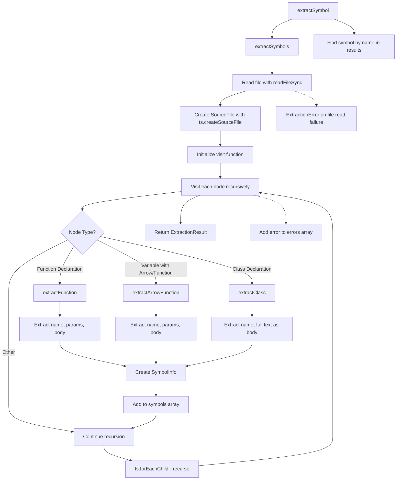

# TypeScriptExtractor

A utility class for parsing and extracting symbols (functions, classes, arrow functions) from TypeScript and JavaScript files using the TypeScript compiler API. It provides methods to extract all symbols from a file or find specific symbols by name, returning structured information about each symbol including its location, parameters, and source code.

<details>
<summary>Visual Flow</summary>



</details>

<details>
<summary>Methods</summary>

### `extractSymbols(filePath: string): ExtractionResult`
Parses a TypeScript/JavaScript file and extracts all function declarations, arrow functions, function expressions, and class declarations. Returns an `ExtractionResult` containing an array of `SymbolInfo` objects and any extraction errors encountered.

### `extractSymbol(filePath: string, symbolName: string): SymbolInfo | null`
Extracts a specific symbol by name from the given file. Returns the `SymbolInfo` object if found, or `null` if the symbol doesn't exist.

### `extractFunction(node: ts.FunctionDeclaration, sourceFile: ts.SourceFile): SymbolInfo` (private)
Processes TypeScript function declaration nodes to extract symbol information including parameters, function body, and source location.

### `extractArrowFunction(decl: ts.VariableDeclaration, sourceFile: ts.SourceFile): SymbolInfo` (private)
Handles variable declarations that contain arrow functions or function expressions, extracting their parameters and bodies with special handling for expression vs block arrow functions.

### `extractClass(node: ts.ClassDeclaration, sourceFile: ts.SourceFile): SymbolInfo` (private)
Processes class declarations, treating the entire class definition as the body content.

</details>

<details>
<summary>Return Value</summary>

### `extractSymbols()`
Returns an `ExtractionResult` object with:
- `symbols`: Array of `SymbolInfo` objects containing extracted symbol data
- `errors`: Array of error messages for symbols that couldn't be processed

### `extractSymbol()`
Returns a single `SymbolInfo` object or `null` if the symbol isn't found.

### `SymbolInfo` Structure
Each extracted symbol contains:
- `name`: Symbol name
- `kind`: Type of symbol (`'function'`, `'const'`, `'class'`)
- `filePath`: Source file path
- `params`: Parameter list as string
- `body`: Function/class body content
- `fullText`: Complete source code
- `startLine`/`endLine`: 1-based line numbers

</details>

<details>
<summary>Usage Examples</summary>

```typescript
// Extract all symbols from a file
const extractor = new TypeScriptExtractor();
const result = extractor.extractSymbols('./src/utils.ts');

console.log(`Found ${result.symbols.length} symbols`);
result.symbols.forEach(symbol => {
  console.log(`${symbol.kind}: ${symbol.name} at lines ${symbol.startLine}-${symbol.endLine}`);
});

// Find a specific function
const myFunction = extractor.extractSymbol('./src/helpers.ts', 'calculateTotal');
if (myFunction) {
  console.log(`Function params: ${myFunction.params}`);
  console.log(`Function body: ${myFunction.body}`);
}

// Handle extraction errors
if (result.errors.length > 0) {
  console.warn('Extraction errors:', result.errors);
}
```

```typescript
// Processing different symbol types
const result = extractor.extractSymbols('./example.ts');

result.symbols.forEach(symbol => {
  switch (symbol.kind) {
    case 'function':
      console.log(`Function ${symbol.name}(${symbol.params})`);
      break;
    case 'const':
      console.log(`Arrow function or const ${symbol.name}`);
      break;
    case 'class':
      console.log(`Class ${symbol.name}`);
      break;
  }
});
```

</details>

<details>
<summary>Implementation Details</summary>

The class uses the TypeScript Compiler API (`ts`) to parse source files into Abstract Syntax Trees (ASTs). Key implementation aspects:

- **File Processing**: Uses `readFileSync()` to read source files and `ts.createSourceFile()` with `ScriptTarget.Latest` for parsing
- **AST Traversal**: Implements a recursive visitor pattern using `ts.forEachChild()` to traverse all nodes
- **Symbol Detection**: Uses TypeScript's type guards (`ts.isFunctionDeclaration()`, `ts.isClassDeclaration()`, etc.) to identify extractable symbols
- **Arrow Function Handling**: Special logic to detect variable declarations containing arrow functions or function expressions
- **Error Resilience**: Wraps individual symbol extraction in try-catch blocks to continue processing other symbols when one fails
- **Line Number Calculation**: Uses `getLineAndCharacterOfPosition()` to convert character positions to 1-based line numbers
- **Text Extraction**: Uses `getText(sourceFile)` to extract clean source code without leading/trailing whitespace

</details>

<details>
<summary>Edge Cases</summary>

- **Anonymous Functions**: Only extracts named functions and functions assigned to variables; anonymous functions are ignored
- **Arrow Function Bodies**: Expression-style arrow functions get wrapped in `{ return ... }` blocks for consistency
- **File Read Errors**: Throws `ExtractionError` for file system issues, but continues processing individual symbol errors
- **Nested Functions**: Inner functions are extracted as separate symbols with their own entries
- **Method Extraction**: Class methods are not individually extracted; only the class declaration itself
- **Export Statements**: Exported functions/classes are extracted the same as non-exported ones
- **TypeScript vs JavaScript**: Works with both `.ts` and `.js` files due to TypeScript's JavaScript parsing capabilities
- **Malformed Syntax**: Individual syntax errors are captured in the `errors` array without stopping overall extraction

</details>

<details>
<summary>Related</summary>

- `SymbolInfo` - The data structure returned for each extracted symbol
- `ExtractionResult` - Container for extraction results and errors
- `ExtractionError` - Custom error type thrown for file-level failures
- TypeScript Compiler API (`ts`) - The underlying parsing engine
- AST (Abstract Syntax Tree) - The tree structure used for code analysis

</details>