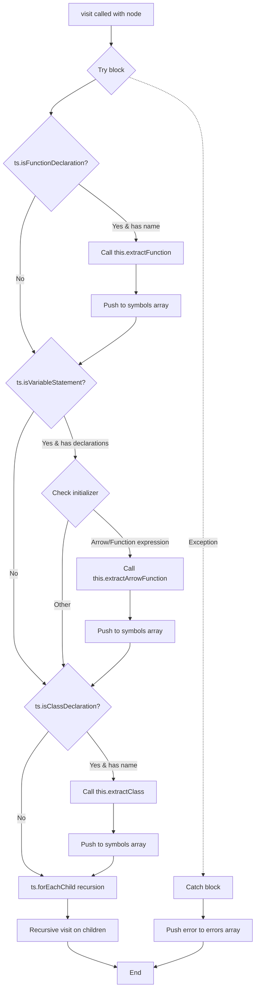

# visit

This const defines a TypeScript AST visitor function that traverses nodes to extract symbols (functions, classes, etc.) from source code. It implements a recursive tree-walking pattern to identify and process different types of declarations while handling errors gracefully.

<details>
<summary>Visual Flow</summary>



</details>

<details>
<summary>Parameters</summary>

| Parameter | Type | Description |
|-----------|------|-------------|
| `node` | `ts.Node` | The TypeScript AST node to visit and process. Can be any type of AST node from the TypeScript compiler API. |

</details>

<details>
<summary>Implementation Details</summary>

The `visit` function implements a visitor pattern for TypeScript AST traversal:

1. **Error Handling**: Wraps all processing in a try-catch block to capture extraction errors
2. **Function Detection**: Uses `ts.isFunctionDeclaration()` to identify named function declarations
3. **Arrow Function Detection**: Checks variable statements for arrow functions and function expressions in initializers
4. **Class Detection**: Uses `ts.isClassDeclaration()` to identify named class declarations
5. **Recursive Traversal**: Calls `ts.forEachChild()` to recursively visit all child nodes
6. **Symbol Collection**: Pushes extracted symbols to a `symbols` array (assumed to be in scope)
7. **Error Collection**: Pushes any errors with position information to an `errors` array

The function relies on external extraction methods:
- `this.extractFunction()` for function declarations
- `this.extractArrowFunction()` for arrow functions and function expressions
- `this.extractClass()` for class declarations

</details>

<details>
<summary>Usage Examples</summary>

```typescript
// Basic usage in a TypeScript AST traversal context
const sourceFile = ts.createSourceFile('example.ts', sourceCode, ts.ScriptTarget.Latest);
const symbols: SymbolInfo[] = [];
const errors: string[] = [];

// Define the visit function
const visit = (node: ts.Node) => {
  // ... implementation as shown
};

// Start traversal from root
visit(sourceFile);
```

```typescript
// Usage within a class-based AST processor
class SymbolExtractor {
  private symbols: SymbolInfo[] = [];
  private errors: string[] = [];

  processFile(sourceFile: ts.SourceFile) {
    const visit = (node: ts.Node) => {
      // ... visit implementation
    };
    
    visit(sourceFile);
    return { symbols: this.symbols, errors: this.errors };
  }
}
```

```typescript
// Processing different node types
// Will extract: function myFunc() {}
const functionNode = /* function declaration node */;
visit(functionNode);

// Will extract: const myArrow = () => {}
const variableNode = /* variable statement with arrow function */;
visit(variableNode);

// Will extract: class MyClass {}
const classNode = /* class declaration node */;
visit(classNode);
```

</details>

<details>
<summary>Edge Cases</summary>

- **Anonymous Functions**: Only processes named function declarations; anonymous functions are ignored
- **Anonymous Classes**: Only processes named class declarations; anonymous classes are ignored
- **Multiple Declarations**: Only processes the first declaration in a variable statement's declaration list
- **Nested Functions**: Recursive traversal will visit nested functions, potentially extracting them multiple times if they're named
- **Error Recovery**: Continues processing other nodes even if extraction fails for a specific node
- **Position Information**: Error messages include node position (`node.pos`) for debugging malformed AST nodes
- **Missing Initializers**: Variable statements without initializers are safely skipped
- **Complex Expressions**: Only detects arrow functions and function expressions as direct initializers, not within complex expressions

</details>

<details>
<summary>Related</summary>

- `ts.forEachChild()` - TypeScript compiler API for AST traversal
- `ts.isFunctionDeclaration()`, `ts.isVariableStatement()`, `ts.isClassDeclaration()` - TypeScript type guards
- `ts.isArrowFunction()`, `ts.isFunctionExpression()` - TypeScript type guards for function types
- `this.extractFunction()`, `this.extractArrowFunction()`, `this.extractClass()` - Symbol extraction methods
- TypeScript AST visitor pattern implementations
- Abstract Syntax Tree (AST) traversal algorithms

</details>