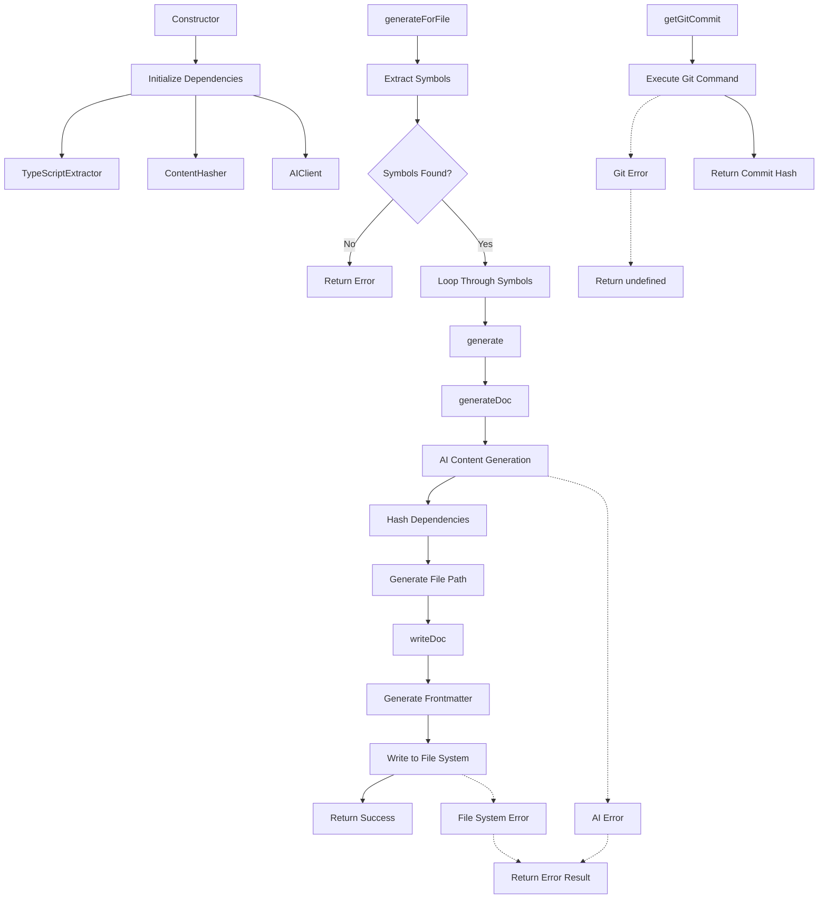

# Generator

The `Generator` class is responsible for creating AI-generated documentation for TypeScript symbols and files. It orchestrates the extraction of symbol information, generates documentation content using an AI client, and writes the output to markdown files with proper frontmatter and dependency tracking.

<details>
<summary>Parameters</summary>

**Constructor Parameters:**

- `config`: `GeneratorConfig` - Configuration object containing:
  - `apiKey`: `string` - API key for the AI client
  - `model`: `string` - AI model to use for generation
  - `style`: `string` - Documentation style preference
  - `outputDir`: `string` - Directory where generated docs will be written

</details>

<details>
<summary>Methods</summary>

### `generate(request: GenerateRequest): Promise<GenerationResult>`

Generates documentation for a single symbol.

**Parameters:**
- `request`: `GenerateRequest` - Contains `symbol`, optional `context`, and optional `customPrompt`

**Returns:** `Promise<GenerationResult>` with `success` boolean and either `filePath` or `error`

### `generateForFile(filePath: string): Promise<GenerationResult[]>`

Generates documentation for all symbols found in a specified file.

**Parameters:**
- `filePath`: `string` - Path to the TypeScript file to process

**Returns:** `Promise<GenerationResult[]>` - Array of results for each symbol processed

### `getGitCommit(): Promise<string | undefined>`

Retrieves the current Git commit hash if the project is in a Git repository.

**Returns:** `Promise<string | undefined>` - The commit hash or `undefined` if not in a Git repo

### Private Methods

- `generateDoc(request: GenerateRequest): Promise<GeneratedDoc>` - Core documentation generation logic
- `writeDoc(doc: GeneratedDoc): void` - Writes documentation to file system
- `generateFrontmatter(doc: GeneratedDoc): string` - Creates YAML frontmatter
- `generateFilePath(symbol: SymbolInfo, fileName: string): string` - Generates output file path
- `generateFileName(symbol: SymbolInfo): string` - Creates kebab-case filename
- `extractTitle(content: string): string | null` - Extracts title from markdown content

</details>

<details>
<summary>Usage Examples</summary>

```typescript
// Basic usage
const config: GeneratorConfig = {
  apiKey: 'your-api-key',
  model: 'gpt-4',
  style: 'technical',
  outputDir: './docs'
};

const generator = new Generator(config);

// Generate docs for a single symbol
const result = await generator.generate({
  symbol: symbolInfo,
  context: {
    projectContext: 'React component library',
    relatedSymbols: [relatedSymbol1, relatedSymbol2]
  }
});

if (result.success) {
  console.log(`Documentation written to: ${result.filePath}`);
} else {
  console.error(`Error: ${result.error}`);
}

// Generate docs for entire file
const results = await generator.generateForFile('./src/components/Button.tsx');
results.forEach(result => {
  if (result.success) {
    console.log(`✓ ${result.filePath}`);
  } else {
    console.error(`✗ ${result.error}`);
  }
});
```

```typescript
// With custom prompt
const result = await generator.generate({
  symbol: symbolInfo,
  customPrompt: 'Focus on performance considerations and best practices'
});
```

</details>

<details>
<summary>Implementation Details</summary>

The `Generator` class follows a pipeline architecture:

1. **Symbol Processing**: Uses `TypeScriptExtractor` to parse and extract symbol information
2. **Content Generation**: Sends symbol data to `AIClient` for documentation generation
3. **Dependency Tracking**: Uses `ContentHasher` to create hashes for change detection
4. **File Output**: Preserves source directory structure in output location
5. **Frontmatter**: Adds YAML metadata including dependencies and generation timestamp

The class maintains dependency graphs by tracking:
- Primary symbol hash for change detection
- Related symbol hashes when provided in context
- File paths and symbol names for reference

File naming converts `PascalCase` to `kebab-case.md` format. Directory structure from source is preserved in the output directory.

</details>

<details>
<summary>Edge Cases</summary>

- **Empty Files**: Returns error result when no symbols are found in a file
- **Missing Output Directory**: Automatically creates directories recursively if they don't exist
- **Git Repository**: Gracefully handles non-Git projects by returning `undefined` for commit hash
- **AI Generation Failures**: Catches and wraps errors in `GenerationResult` format
- **File System Errors**: Directory creation and file writing errors are propagated up
- **Symbol Name Edge Cases**: Handles symbols starting with uppercase letters in filename generation
- **Title Extraction**: Falls back to symbol name if no H1 heading is found in generated content

</details>

<details>
<summary>Related</summary>

- `TypeScriptExtractor` - Extracts symbol information from TypeScript files
- `ContentHasher` - Creates content hashes for dependency tracking
- `AIClient` - Handles communication with AI services for content generation
- `GeneratorConfig` - Configuration interface for the generator
- `GenerateRequest` - Request format for single symbol generation
- `GenerationResult` - Result format returned by generation methods
- `SymbolInfo` - TypeScript symbol metadata structure
- `GeneratedDoc` - Internal document representation with metadata

</details>

<details>
<summary>Visual Flow</summary>



</details>