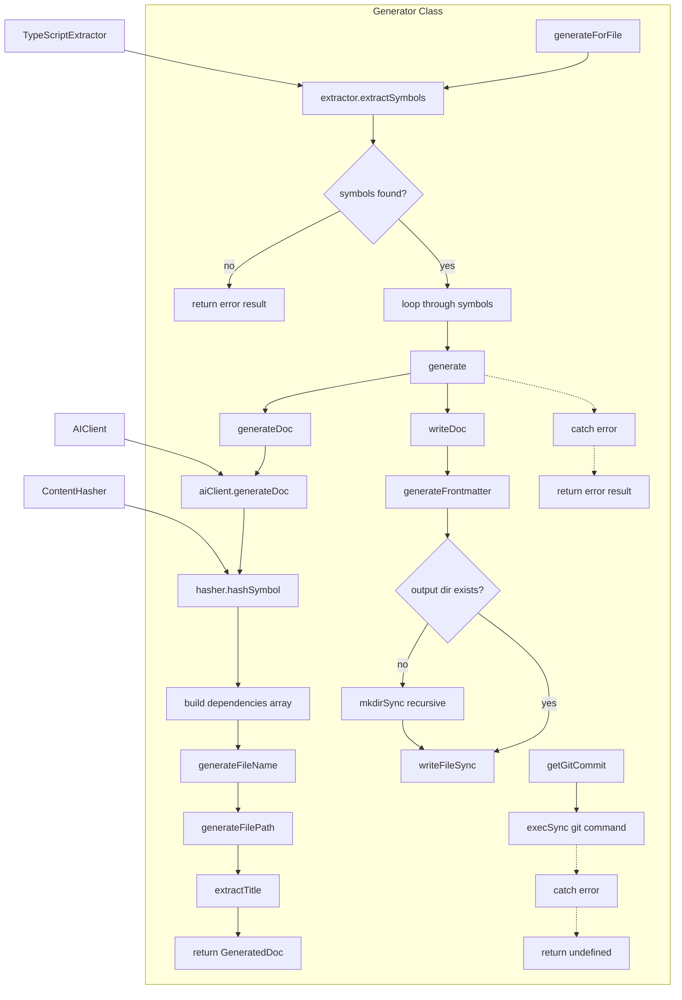

# Generator

A documentation generation orchestrator that extracts TypeScript symbols, generates AI-powered documentation content, and writes structured markdown files with dependency tracking. It manages the complete workflow from symbol extraction to file output, including content hashing for change detection and automatic directory structure preservation.

<details>
<summary>Visual Flow</summary>



</details>

<details>
<summary>Parameters</summary>

**Constructor Parameters:**
- `config: GeneratorConfig` - Configuration object containing:
  - `apiKey: string` - API key for AI client
  - `model: string` - AI model to use for documentation generation
  - `style: string` - Documentation style preference
  - `outputDir: string` - Directory where generated docs will be written

</details>

<details>
<summary>Methods</summary>

**Public Methods:**

`generate(request: GenerateRequest): Promise<GenerationResult>`
- Generates documentation for a single symbol
- Returns success/failure result with file path or error message

`generateForFile(filePath: string): Promise<GenerationResult[]>`
- Extracts all symbols from a file and generates documentation for each
- Returns array of generation results

`getGitCommit(): Promise<string | undefined>`
- Retrieves current Git commit hash if available
- Returns `undefined` if not in a Git repository or command fails

**Private Methods:**

`generateDoc(request: GenerateRequest): Promise<GeneratedDoc>`
- Core documentation generation logic
- Coordinates AI content generation, dependency tracking, and file path creation

`writeDoc(doc: GeneratedDoc): void`
- Writes documentation to file with YAML frontmatter
- Creates output directories as needed

`generateFrontmatter(doc: GeneratedDoc): string`
- Creates YAML frontmatter with metadata and dependencies

`generateFilePath(symbol: SymbolInfo, fileName: string): string`
- Generates output file path preserving source directory structure

`generateFileName(symbol: SymbolInfo): string`
- Converts symbol name to kebab-case filename with `.md` extension

`extractTitle(content: string): string | null`
- Extracts title from first H1 heading in markdown content

</details>

<details>
<summary>Return Value</summary>

**`generate()` and `generateForFile()` return `GenerationResult`:**
```typescript
{
  success: boolean;
  filePath?: string;    // Present when success is true
  error?: string;       // Present when success is false
}
```

**`getGitCommit()` returns:**
- `string` - Git commit hash if successful
- `undefined` - If not in Git repo or command fails

</details>

<details>
<summary>Usage Examples</summary>

**Basic symbol documentation generation:**
```typescript
const config = {
  apiKey: 'your-api-key',
  model: 'gpt-4',
  style: 'technical',
  outputDir: './docs'
};

const generator = new Generator(config);

const request = {
  symbol: {
    name: 'MyClass',
    type: 'class',
    filePath: '/src/myClass.ts',
    // ... other symbol properties
  }
};

const result = await generator.generate(request);
if (result.success) {
  console.log(`Documentation written to: ${result.filePath}`);
} else {
  console.error(`Generation failed: ${result.error}`);
}
```

**Generate documentation for entire file:**
```typescript
const results = await generator.generateForFile('./src/utils.ts');

for (const result of results) {
  if (result.success) {
    console.log(`✓ Generated: ${result.filePath}`);
  } else {
    console.error(`✗ Failed: ${result.error}`);
  }
}
```

**With context and custom prompt:**
```typescript
const request = {
  symbol: mySymbol,
  context: {
    projectContext: 'This is a React component library',
    relatedSymbols: [relatedSymbol1, relatedSymbol2]
  },
  customPrompt: 'Focus on usage examples and props'
};

const result = await generator.generate(request);
```

</details>

<details>
<summary>Implementation Details</summary>

**Dependency Management:**
- Each generated document includes a `dependencies` array in frontmatter
- Dependencies include the source symbol and any related symbols
- Content hashes enable change detection for incremental updates
- File paths are stored as relative paths for portability

**File Organization:**
- Output structure mirrors source directory structure
- Files are organized as: `outputDir/sourceDir/sourceFile/symbol-name.md`
- Directory creation is handled automatically with recursive `mkdir`

**Content Generation Pipeline:**
1. Extract symbol information using `TypeScriptExtractor`
2. Generate content via `AIClient` with configurable style and context
3. Hash symbol content for dependency tracking
4. Generate appropriate file paths preserving directory structure
5. Create frontmatter with metadata and dependencies
6. Write complete document to file system

**Error Handling:**
- All public methods return result objects instead of throwing
- File system operations are wrapped with automatic directory creation
- Git operations fail gracefully when not in a repository

</details>

<details>
<summary>Edge Cases</summary>

**Empty Symbol Files:**
- `generateForFile()` returns error result when no symbols found
- Individual symbol generation can still succeed if symbol is valid

**File System Issues:**
- Output directories are created recursively if they don't exist
- File write errors are caught and returned as error results
- Path resolution handles both absolute and relative source paths

**Git Repository Detection:**
- `getGitCommit()` gracefully handles non-Git directories
- Command execution failures return `undefined` rather than throwing

**Symbol Name Conflicts:**
- File names use kebab-case conversion to avoid conflicts
- Directory structure separation prevents most naming collisions
- Multiple symbols with same name in different files get separate directories

**Content Extraction:**
- Title extraction falls back to symbol name if no H1 found
- Empty or malformed markdown content is still written with valid frontmatter

</details>

<details>
<summary>Related</summary>

- `TypeScriptExtractor` - Extracts symbols from TypeScript source files
- `AIClient` - Handles AI-powered content generation
- `ContentHasher` - Generates hashes for change detection
- `GeneratorConfig` - Configuration interface for generator setup
- `GenerateRequest` - Request structure for documentation generation
- `GenerationResult` - Result structure returned by generation methods
- `SymbolInfo` - Symbol metadata structure from extraction

</details>