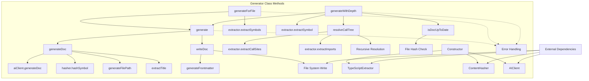

# Generator

A core documentation generation class that orchestrates TypeScript code analysis, AI-powered content generation, and markdown file output with dependency tracking. It provides methods for generating documentation for individual symbols or entire files, with support for call-tree traversal to include related function documentation.

<details>
<summary>Visual Flow</summary>



</details>

<details>
<summary>Parameters</summary>

**Constructor Parameters:**
- `config: GeneratorConfig` - Configuration object containing:
  - `apiKey: string` - API key for AI client
  - `model: string` - AI model to use for generation
  - `outputDir: string` - Directory for generated documentation
  - `style: string` - Documentation style preference

</details>

<details>
<summary>Methods</summary>

**`generate(request: GenerateRequest): Promise<GenerationResult>`**
- Generates documentation for a single symbol
- Handles the complete generation pipeline from content creation to file output
- Returns success/failure status with file path or error message

**`generateForFile(filePath: string): Promise<GenerationResult[]>`**
- Extracts all symbols from a TypeScript file and generates documentation for each
- Returns array of generation results for all discovered symbols

**`generateWithDepth(filePath: string, options): Promise<GenerationResult[]>`**
- Advanced generation with call-tree traversal support
- Options include `symbolName`, `depth`, `force`, and `onProgress` callback
- Resolves dependencies and generates documentation for related symbols

**`resolveCallTree(symbol: SymbolInfo, depth: number, visited?: Set<string>): SymbolInfo[]`**
- Recursively discovers symbols called by the target symbol
- Handles both same-file and cross-file function calls via import resolution
- Prevents infinite recursion with visited set tracking

**`isDocUpToDate(symbol: SymbolInfo): boolean`**
- Checks if existing documentation matches current symbol hash
- Enables incremental generation by skipping unchanged symbols

**`getDocPath(symbol: SymbolInfo): string`**
- Returns the expected file path for a symbol's documentation
- Uses consistent naming and directory structure

</details>

<details>
<summary>Return Value</summary>

Most methods return `Promise<GenerationResult>` or `Promise<GenerationResult[]>` where `GenerationResult` contains:
- `success: boolean` - Whether generation succeeded
- `filePath?: string` - Path to generated file (on success)
- `error?: string` - Error message (on failure)
- `skipped?: boolean` - Whether generation was skipped (for up-to-date docs)

</details>

<details>
<summary>Usage Examples</summary>

**Basic symbol generation:**
```typescript
const generator = new Generator({
  apiKey: 'your-api-key',
  model: 'gpt-4',
  outputDir: './docs',
  style: 'technical'
});

const result = await generator.generate({
  symbol: symbolInfo,
  context: { projectContext: 'React application' }
});

if (result.success) {
  console.log(`Generated: ${result.filePath}`);
}
```

**Generate for entire file:**
```typescript
const results = await generator.generateForFile('./src/utils.ts');
results.forEach(result => {
  if (result.success) {
    console.log(`Generated: ${result.filePath}`);
  } else {
    console.error(`Failed: ${result.error}`);
  }
});
```

**Generate with call-tree traversal:**
```typescript
const results = await generator.generateWithDepth('./src/api.ts', {
  symbolName: 'fetchUserData',
  depth: 2,
  force: true,
  onProgress: (message, type) => console.log(`[${type}] ${message}`)
});
```

**Check if documentation is current:**
```typescript
if (!generator.isDocUpToDate(symbol)) {
  await generator.generate({ symbol });
}
```

</details>

<details>
<summary>Implementation Details</summary>

The `Generator` class coordinates several specialized components:

- **`TypeScriptExtractor`**: Parses TypeScript files to extract symbol information, call sites, and imports
- **`ContentHasher`**: Creates SHA-256 hashes of symbols for change detection
- **`AIClient`**: Interfaces with AI services to generate human-readable documentation

**File Organization:**
- Preserves source directory structure in output
- Generates kebab-case filenames from symbol names
- Creates nested directories: `outputDir/sourcePath/sourceFile/symbol-name.md`

**Frontmatter Generation:**
- Adds YAML frontmatter with title, generation timestamp, and dependency tracking
- Dependencies include file paths, symbol names, and content hashes
- Enables incremental regeneration by comparing hashes

**Call Tree Resolution:**
- Recursively follows function calls up to specified depth
- Resolves imports to handle cross-file dependencies
- Uses visited set to prevent infinite recursion
- Supports both named and default imports

</details>

<details>
<summary>Edge Cases</summary>

**Symbol Resolution:**
- Handles same-named symbols in different scopes by using file path as part of the key
- Falls back gracefully when import resolution fails
- Skips unresolvable external dependencies

**File System Operations:**
- Creates output directories recursively if they don't exist
- Handles file write permissions errors in the error response
- Uses UTF-8 encoding consistently

**Hash-based Caching:**
- Hash comparison may miss changes in dependencies (only checks direct symbol hash)
- Force flag bypasses all caching when complete regeneration is needed
- Git integration attempts to get commit hash but degrades gracefully

**Call Tree Depth:**
- Zero depth generates only the target symbol(s)
- Deep call trees can discover many symbols; progress callback helps track status
- Circular dependencies are handled by the visited set

</details>

<details>
<summary>Related</summary>

- **`TypeScriptExtractor`**: Handles code parsing and symbol extraction
- **`ContentHasher`**: Provides change detection capabilities  
- **`AIClient`**: Manages AI service integration for content generation
- **`GenerateRequest`**: Input interface for generation requests
- **`GenerationResult`**: Output interface for generation responses
- **`SymbolInfo`**: Core data structure representing extracted code symbols

</details>