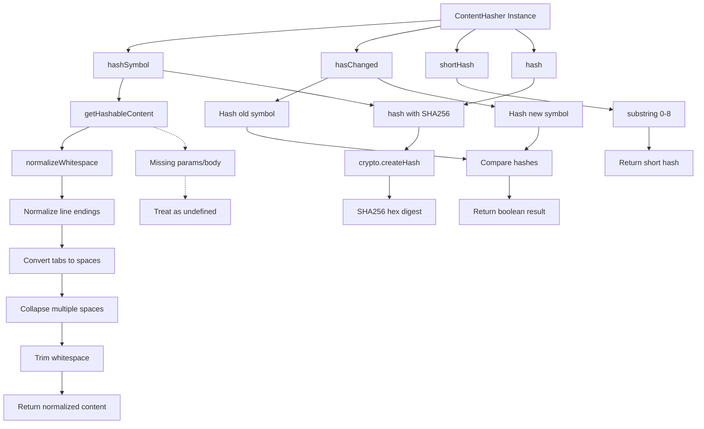

# ContentHasher

The `ContentHasher` class provides content-based hashing functionality for symbols, designed to detect meaningful changes while ignoring cosmetic modifications like renames and formatting. It generates SHA256 hashes of symbol parameters and body content, with whitespace normalization to prevent formatting changes from triggering false positives.

<details>
<summary>Methods</summary>

## `hashSymbol(symbol: SymbolInfo): string`
Generates a hash of the symbol's meaningful content (parameters and body), excluding the name to allow renames without triggering staleness detection.

**Parameters:**
- `symbol`: `SymbolInfo` - The symbol object to hash

**Returns:** `string` - SHA256 hex digest of the symbol's content

## `getHashableContent(symbol: SymbolInfo): string`
Extracts and normalizes the content that should be included in the hash. Combines symbol parameters and body while excluding name, export keywords, and visibility modifiers.

**Parameters:**
- `symbol`: `SymbolInfo` - The symbol object to process

**Returns:** `string` - Normalized string containing parameters and body content

## `hash(content: string): string`
Generates a SHA256 hash of the provided content string.

**Parameters:**
- `content`: `string` - The content to hash

**Returns:** `string` - SHA256 hex digest

## `normalizeWhitespace(content: string): string` (private)
Normalizes whitespace in content to prevent formatting changes from affecting hash values. Converts line endings, tabs to spaces, collapses multiple spaces, and trims whitespace.

**Parameters:**
- `content`: `string` - The content to normalize

**Returns:** `string` - Content with normalized whitespace

## `hasChanged(oldSymbol: SymbolInfo, newSymbol: SymbolInfo): boolean`
Compares two symbols by their content hashes to determine if meaningful changes occurred.

**Parameters:**
- `oldSymbol`: `SymbolInfo` - The previous version of the symbol
- `newSymbol`: `SymbolInfo` - The current version of the symbol

**Returns:** `boolean` - `true` if content has changed, `false` otherwise

## `shortHash(hash: string): string`
Generates a shortened version of a hash for display purposes.

**Parameters:**
- `hash`: `string` - The full hash string

**Returns:** `string` - First 8 characters of the hash

</details>

<details>
<summary>Usage Examples</summary>

```typescript
import { ContentHasher } from './content-hasher';

const hasher = new ContentHasher();

// Hash a symbol
const symbol: SymbolInfo = {
  name: 'calculateSum',
  params: '(a: number, b: number)',
  body: '{ return a + b; }'
};

const hash = hasher.hashSymbol(symbol);
console.log(hash); // "a1b2c3d4e5f6..."

// Compare symbols for changes
const oldSymbol = { name: 'add', params: '(x, y)', body: '{ return x + y; }' };
const newSymbol = { name: 'sum', params: '(x, y)', body: '{ return x + y; }' };

// Name change doesn't trigger staleness
console.log(hasher.hasChanged(oldSymbol, newSymbol)); // false

// Content change does trigger staleness
const modifiedSymbol = { name: 'sum', params: '(x, y)', body: '{ return x * y; }' };
console.log(hasher.hasChanged(oldSymbol, modifiedSymbol)); // true

// Get display-friendly short hash
const shortHash = hasher.shortHash(hash);
console.log(shortHash); // "a1b2c3d4"

// Direct content hashing
const content = hasher.getHashableContent(symbol);
const directHash = hasher.hash(content);
```

</details>

<details>
<summary>Implementation Details</summary>

The `ContentHasher` class uses SHA256 cryptographic hashing to generate consistent, deterministic hashes of symbol content. Key implementation details:

- **Content Selection**: Only `params` and `body` properties from `SymbolInfo` are hashed, deliberately excluding `name` to allow refactoring without staleness
- **Whitespace Normalization**: Applied before hashing to ensure formatting changes don't affect hash values:
  - Line endings normalized to `\n`
  - Tabs converted to double spaces
  - Multiple consecutive spaces collapsed to single space
  - Leading and trailing whitespace trimmed
- **Hash Algorithm**: Uses Node.js built-in `crypto.createHash('sha256')` for cryptographically secure hashing
- **String Concatenation**: Parameters and body are directly concatenated before normalization - no delimiter needed since structure is preserved

The class is stateless and thread-safe, with all methods being pure functions that don't modify input parameters.

</details>

<details>
<summary>Edge Cases</summary>

- **Empty Content**: If both `params` and `body` are empty or whitespace-only, results in hash of empty string after normalization
- **Identical Formatting**: Different whitespace formatting of identical logic produces the same hash due to normalization
- **Unicode Content**: SHA256 handles Unicode characters correctly, but ensure consistent encoding across environments
- **Very Large Symbols**: No explicit size limits, but extremely large symbol bodies may impact performance
- **Missing Properties**: If `SymbolInfo` object lacks `params` or `body` properties, they're treated as `undefined` and concatenated as "undefined"
- **Hash Collisions**: While theoretically possible with SHA256, probability is negligible for practical symbol content sizes
- **Short Hash Conflicts**: 8-character short hashes have higher collision probability - only use for display, not comparison logic

</details>

<details>
<summary>Related</summary>

- `SymbolInfo` interface - Input type containing symbol metadata
- `crypto.createHash()` - Node.js cryptographic hashing function
- Symbol analysis and change detection systems
- Content versioning and caching mechanisms
- Code fingerprinting and staleness detection

</details>

<details>
<summary>Visual Flow</summary>



</details>