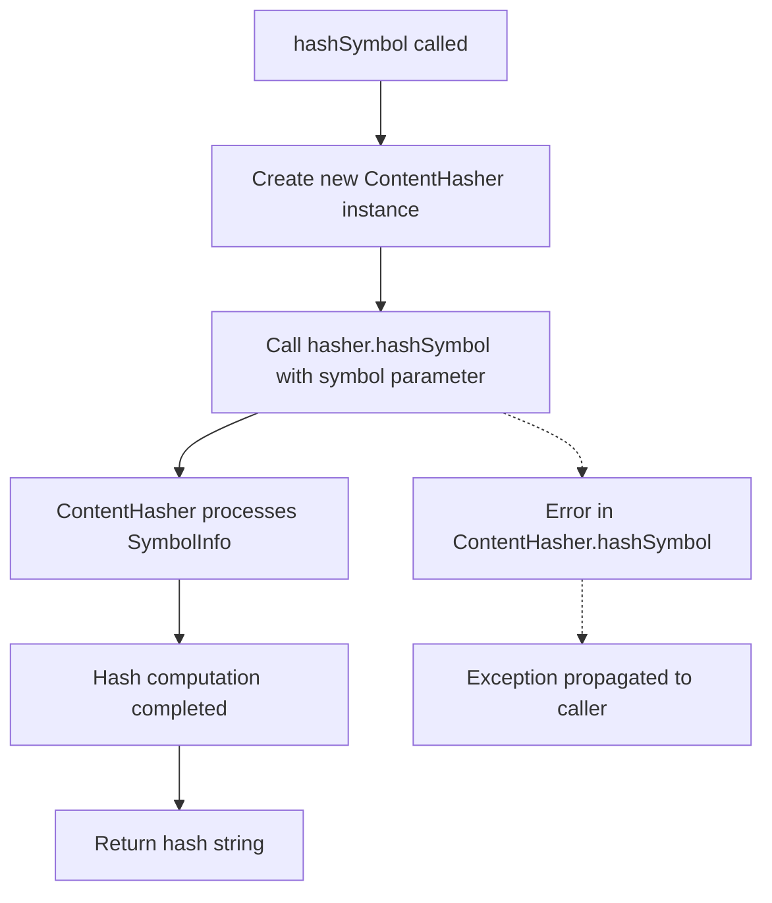

# hashSymbol

The `hashSymbol` function generates a hash string for a given `SymbolInfo` object. It creates a `ContentHasher` instance and delegates the hashing operation to compute a consistent string representation of the symbol's content.

<details>
<summary>Parameters</summary>

- `symbol` (`SymbolInfo`): The symbol information object to be hashed. Contains metadata and properties that uniquely identify a symbol in the codebase.

</details>

<details>
<summary>Return Value</summary>

Returns a `string` representing the computed hash of the provided `SymbolInfo` object. The hash is deterministic and will produce the same result for identical symbol information.

</details>

<details>
<summary>Usage Examples</summary>

```typescript
import { hashSymbol } from './hash-utils';

// Hash a function symbol
const functionSymbol: SymbolInfo = {
  name: 'calculateTotal',
  type: 'function',
  // ... other symbol properties
};
const hash1 = hashSymbol(functionSymbol);
console.log(hash1); // "a1b2c3d4e5f6..."

// Hash a class symbol
const classSymbol: SymbolInfo = {
  name: 'UserService',
  type: 'class',
  // ... other symbol properties
};
const hash2 = hashSymbol(classSymbol);
console.log(hash2); // "f6e5d4c3b2a1..."

// Multiple calls with same symbol produce identical hashes
const duplicateHash = hashSymbol(functionSymbol);
console.log(hash1 === duplicateHash); // true
```

</details>

<details>
<summary>Implementation Details</summary>

The function serves as a lightweight wrapper around the `ContentHasher` class. It instantiates a new `ContentHasher` object for each call and immediately delegates the hashing operation to the `hashSymbol` method of that instance. This design provides a clean, functional interface while leveraging the more complex hashing logic encapsulated within the `ContentHasher` class.

The actual hashing algorithm and symbol processing logic are handled entirely by the `ContentHasher.hashSymbol()` method, making this function a simple factory pattern implementation.

</details>

<details>
<summary>Edge Cases</summary>

- **Null/Undefined Symbol**: If `null` or `undefined` is passed as the `symbol` parameter, the behavior depends on the `ContentHasher.hashSymbol()` implementation
- **Empty Symbol**: Symbols with minimal or empty properties may still produce valid hashes, depending on the hashing strategy used by `ContentHasher`
- **Large Symbols**: Complex symbols with extensive metadata should hash successfully, but performance may vary based on the symbol's size and complexity
- **Symbol Mutations**: Modifying the `symbol` object after hashing will not affect the previously computed hash, as the hash represents a snapshot of the symbol's state at the time of computation

</details>

<details>
<summary>Related</summary>

- `ContentHasher` - The underlying class that performs the actual hashing logic
- `ContentHasher.hashSymbol()` - The method that handles the core symbol hashing implementation
- `SymbolInfo` - The type definition for symbol objects that can be hashed

</details>

<details>
<summary>Visual Flow</summary>



</details>