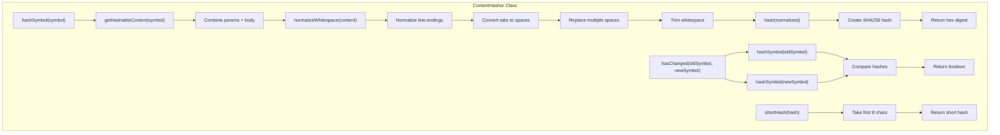

# ContentHasher

A utility class for generating consistent content hashes of code symbols based on their implementation details. It focuses on hashing only the functional content (parameters and body) while ignoring cosmetic elements like names, formatting, and visibility modifiers to prevent unnecessary cache invalidation.

<details>
<summary>Visual Flow</summary>



</details>

<details>
<summary>Methods</summary>

### `hashSymbol(symbol: SymbolInfo): string`
Generates a SHA256 hash of the symbol's functional content (parameters and body), excluding the name to allow renames without triggering staleness.

### `getHashableContent(symbol: SymbolInfo): string`
Extracts and normalizes the hashable content from a symbol, combining `params` and `body` while applying whitespace normalization to ignore formatting differences.

### `hash(content: string): string`
Creates a SHA256 hash of the provided content string and returns it as a hexadecimal digest.

### `normalizeWhitespace(content: string): string` (private)
Normalizes whitespace in content to ensure formatting changes don't affect hash values. Handles line endings, tabs, multiple spaces, and leading/trailing whitespace.

### `hasChanged(oldSymbol: SymbolInfo, newSymbol: SymbolInfo): boolean`
Compares two symbols by hashing their content to determine if the functional implementation has changed.

### `shortHash(hash: string): string`
Returns the first 8 characters of a hash for display purposes or when a shorter identifier is needed.

</details>

<details>
<summary>Usage Examples</summary>

```typescript
import { ContentHasher } from './ContentHasher';

const hasher = new ContentHasher();

// Hash a symbol
const symbol: SymbolInfo = {
  name: 'calculateTotal',
  params: '(price: number, tax: number)',
  body: '{ return price * (1 + tax); }'
};

const hash = hasher.hashSymbol(symbol);
console.log(hash); // "a1b2c3d4e5f6..."

// Check if symbols have changed
const oldSymbol: SymbolInfo = {
  name: 'oldName',
  params: '(x: number)',
  body: '{ return x * 2; }'
};

const newSymbol: SymbolInfo = {
  name: 'newName', // Name changed but implementation is the same
  params: '(x: number)',
  body: '{ return x * 2; }'
};

const changed = hasher.hasChanged(oldSymbol, newSymbol);
console.log(changed); // false - only name changed, not implementation

// Get short hash for display
const shortHash = hasher.shortHash(hash);
console.log(shortHash); // "a1b2c3d4"

// Direct content hashing
const content = "function example() { return true; }";
const directHash = hasher.hash(content);
```

</details>

<details>
<summary>Implementation Details</summary>

The `ContentHasher` class implements a content-aware hashing strategy that focuses on functional changes rather than cosmetic ones:

**Hash Generation Process:**
1. Extracts `params` and `body` from the `SymbolInfo` object
2. Concatenates the parameters and body content
3. Normalizes whitespace to eliminate formatting variations
4. Generates SHA256 hash of the normalized content

**Whitespace Normalization:**
- Converts Windows line endings (`\r\n`) to Unix format (`\n`)
- Replaces tabs with two spaces for consistency
- Collapses multiple consecutive spaces into single spaces
- Removes leading and trailing whitespace

**Hash Algorithm:**
Uses Node.js built-in `crypto.createHash('sha256')` for consistent, cryptographically strong hashing across different environments.

</details>

<details>
<summary>Edge Cases</summary>

**Symbol Renaming:**
- Changing only the symbol name won't affect the hash, allowing safe refactoring without cache invalidation
- This is intentional behavior to support renaming operations

**Whitespace Sensitivity:**
- Different indentation styles (tabs vs spaces) produce the same hash
- Trailing whitespace and extra blank lines are ignored
- Line ending differences between operating systems are normalized

**Empty Content:**
- Symbols with empty `params` or `body` will still generate valid hashes
- Two symbols with identical empty content will produce the same hash

**Unicode Content:**
- The hasher handles Unicode characters in symbol content correctly
- UTF-8 encoding is used consistently for hash generation

**Hash Collisions:**
- While theoretically possible with SHA256, collisions are extremely unlikely in practice
- The `shortHash()` method increases collision probability but is intended only for display purposes

</details>

<details>
<summary>Related</summary>

- **SymbolInfo Interface:** The input type that contains symbol metadata including `name`, `params`, and `body` properties
- **Node.js Crypto Module:** Uses the built-in `createHash` function for SHA256 generation
- **Cache Invalidation:** This class is typically used in caching systems to determine when cached symbol data should be refreshed
- **Code Analysis Tools:** Often integrated with static analysis pipelines for change detection

</details>