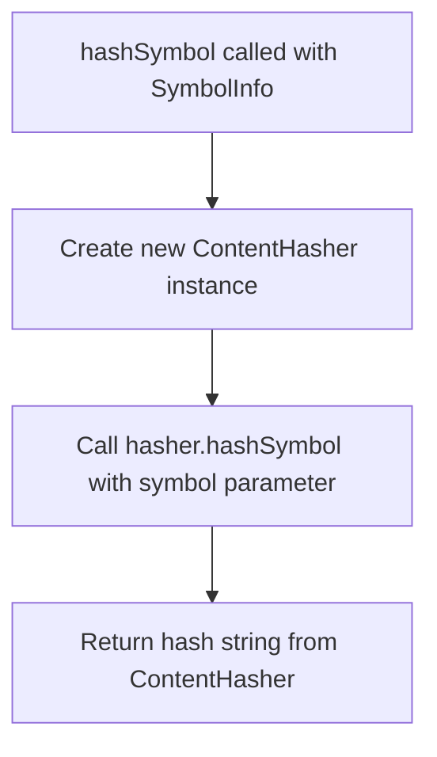

# hashSymbol

This function generates a hash string for a given `SymbolInfo` object. It creates a new `ContentHasher` instance and delegates to its `hashSymbol` method to produce a deterministic hash representation of the symbol.

<details>
<summary>Visual Flow</summary>



</details>

<details>
<summary>Parameters</summary>

- `symbol: SymbolInfo` - The symbol information object to be hashed. This contains the symbol data that will be processed by the `ContentHasher` to generate a unique hash string.

</details>

<details>
<summary>Return Value</summary>

Returns a `string` representing the hash of the provided `SymbolInfo` object. The hash is generated by the `ContentHasher.hashSymbol()` method and serves as a deterministic identifier for the symbol.

</details>

<details>
<summary>Usage Examples</summary>

```typescript
import { hashSymbol } from './path/to/module';

// Hash a symbol info object
const symbolInfo: SymbolInfo = {
  name: 'myFunction',
  type: 'function',
  // ... other SymbolInfo properties
};

const hash = hashSymbol(symbolInfo);
console.log(hash); // Output: "abc123def456..."

// Use in symbol comparison
const symbol1Hash = hashSymbol(symbol1);
const symbol2Hash = hashSymbol(symbol2);
const areEqual = symbol1Hash === symbol2Hash;

// Store hashes for caching
const symbolCache = new Map<string, SymbolInfo>();
const key = hashSymbol(symbolInfo);
symbolCache.set(key, symbolInfo);
```

</details>

<details>
<summary>Implementation Details</summary>

The function serves as a thin wrapper around the `ContentHasher` class. It:

1. Instantiates a new `ContentHasher` object for each call
2. Delegates the actual hashing logic to the `ContentHasher.hashSymbol()` method
3. Returns the resulting hash string directly

The function creates a new `ContentHasher` instance on each invocation rather than reusing a shared instance, which may be intentional for thread safety or to ensure clean state for each hashing operation.

</details>

<details>
<summary>Edge Cases</summary>

- The function will throw an error if the `symbol` parameter is `null` or `undefined`, depending on the implementation of `ContentHasher.hashSymbol()`
- The behavior with invalid or malformed `SymbolInfo` objects depends entirely on the `ContentHasher` implementation
- Hash consistency relies on the deterministic behavior of the underlying `ContentHasher.hashSymbol()` method

</details>

<details>
<summary>Related</summary>

- `ContentHasher` - The class responsible for the actual hashing implementation
- `ContentHasher.hashSymbol()` - The underlying method that performs the hash calculation
- `SymbolInfo` - The type definition for symbol information objects that can be hashed

</details>